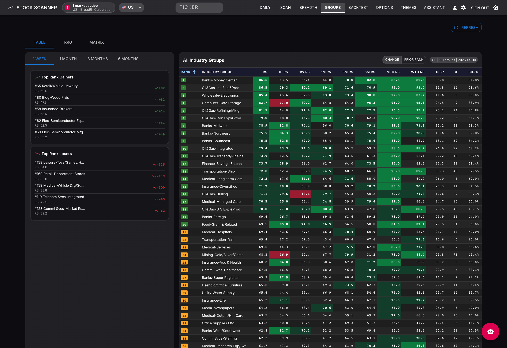
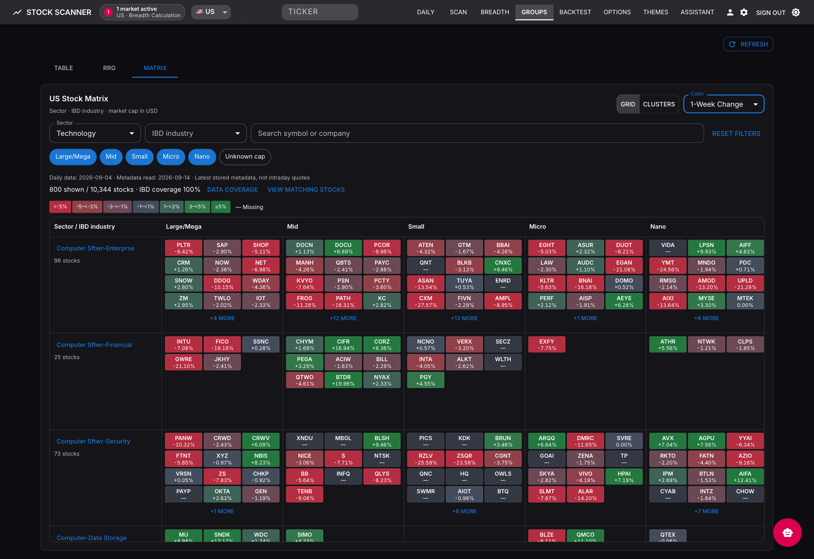
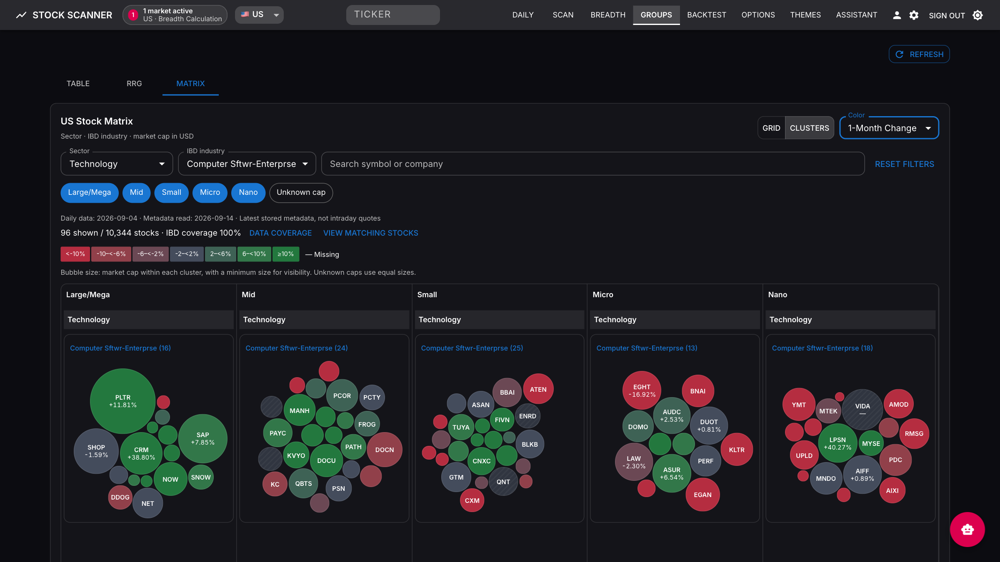

# Group rankings, Matrix and Clusters

The **Groups** page combines industry relative-strength rankings, the Relative Rotation Graph (RRG), and a stock-level **Matrix** tab. Matrix is available in both the live application and the static site when the selected market has a compatible published feature snapshot and IBD mappings.

## Open and explore

1. Open **Groups** (`/groups`) and select a market.
2. Use the rankings table to compare group RS and rank changes, or open **RRG** to explore rotation.
3. Open **Matrix**. Choose **Grid** or **Clusters**, then a color metric.
4. Narrow the view by sector, IBD industry group, market-cap tier, or ticker/company search. Filters intersect.
5. Hover over or focus a stock to inspect it. Click, Enter, or Space opens its details. Use group headings and overflow controls to reach stocks omitted from the compact preview.

Changing layout preserves filters and the color metric. Changing market clears stock-specific filters and selection while retaining layout, color, and tier preferences for the mounted page. Reset filters restores the stock filters.



The screenshot uses published rankings dated **September 10, 2026**. Group RS is an aggregate; Matrix colors use each individual stock's values.

## Grid

Grid organizes stocks into **sector sections → IBD industry rows → market-cap columns**. Stock tiles have equal area. Each cell previews up to 12 stocks; the remaining-stock control opens the full matching list. Rows are virtualized so large universes do not create thousands of offscreen controls.



This screenshot filters the published US universe to Technology, scrolls to software-industry rows, and colors stocks by **1-Week Change**.

## Clusters

Clusters uses the same filtered stocks and market-cap columns, with one compact circle pack for each industry/sector combination. Each card previews up to 64 stocks. Bubble area represents relative USD market cap **within that card**, with a minimum visible area of 1% of the largest bubble's weight. Sizes are independently normalized per card and should not be compared across cards as a common dollar scale.

The selected metric orders the pack outward: **green in the center, neutral between, red toward the perimeter**. Changing the metric recolors and repacks the same preview members. Unequal bubble sizes produce organic bands rather than exact concentric rings. Missing returns participate in the neutral position without being converted to zero in the displayed data; missing RS uses the midpoint for positioning only. This is a visual arrangement, not correlation or relationship analysis.



This screenshot selects Technology / Computer Sftwr-Enterprse and **1-Month Change**. The Matrix screenshots use the published feature snapshot dated **September 4, 2026**. They are actual stored data, not current quotes or generated sample returns. Classification and cap metadata can have a newer read date than the feature snapshot.

## Color metrics

| Choice | Stored source | Meaning |
|---|---|---|
| 1-Day Change (default) | `price_change_1d` | Stored daily percentage change |
| 1-Week Change | `details_json.perf_week` → `price_change_1w` | Stored weekly percentage change; the local technical calculator uses 5 trading sessions |
| 1-Month Change | `details_json.perf_month` → `price_change_1m` | Stored monthly percentage change; the local technical calculator uses 21 trading sessions |
| Stock RS | `rs_rating` | Individual stock relative-strength rating on a 0–100 scale |

Returns are percentage points: `4.5` means **+4.50%**. They are read from the selected published feature run, including provider-supplied values where present. Opening Matrix does not download quotes, compute new history, or derive returns from sparklines. These return periods are separate from the rankings table's changes in group rank.

The three return scales use seven fixed bins. Only the color saturates; the inspector and details retain the exact value.

| Metric | Six boundaries between red → neutral → green bins | Neutral interval |
|---|---|---|
| 1-Day | −2.5, −1.5, −0.5, +0.5, +1.5, +2.5% | [−0.5%, +0.5%) |
| 1-Week | −5, −3, −1, +1, +3, +5% | [−1%, +1%) |
| 1-Month | −10, −6, −2, +2, +6, +10% | [−2%, +2%) |

Each boundary is inclusive for the bin to its right. RS reuses the group-tone thresholds: ≤20, >20–30, >30–<70, 70–<80, and ≥80. RS is never displayed as a percentage return. The legend updates with the chosen metric in both layouts.

### Missing data and inspection

Missing or invalid returns display **—** with a separate missing-data color. A genuine zero remains a valid neutral value. Coverage notices count missing daily, weekly, monthly, and RS values across the payload; missing values do not remove stocks from the map.

The shared hover/focus inspector and stock drawer show all three returns, stock RS, USD cap, sector, IBD group, classification source/confidence, feature date, metadata read time, and available source-update dates. Escape dismisses the inspector/drawer. Small bubbles still have accessible stock descriptions; the full matching-stock list provides an alternative to selecting tiny circles.

## Market-cap tiers and taxonomy

| Tier | USD market cap |
|---|---|
| Large/Mega | ≥ $10 billion |
| Mid | ≥ $2 billion and < $10 billion |
| Small | ≥ $300 million and < $2 billion |
| Micro | ≥ $50 million and < $300 million |
| Nano | > $0 and < $50 million |
| Unknown cap | Missing, nonpositive, or invalid USD cap |

The backend assigns these application-defined tiers from stored USD fundamentals. Matrix performs no request-time currency conversion. Missing sectors and IBD mappings appear as **Unknown sector** and **Unclassified IBD**. If an industry spans sectors it appears in each relevant sector, without duplicating any stock globally. Automatically classified mappings retain their source/confidence; they are not presented as official assignments. A market with no IBD mappings shows an unavailable state instead of silently substituting another taxonomy.

## Live and static data delivery

Both pages share the same panel, layout, colors, and `group-matrix-v1` payload builder.

- **Live:** `GET /api/v1/groups/matrix?market=US` reads the latest compatible published run. The assembled response is cached for 60 seconds; a new run identity gets a new cache key. Viewing is read-only and does not start scans, classification, or provider jobs.
- **Static:** the market manifest advertises `assets.groups_matrix`, normally `markets/us/groups_matrix.json`. The page loads that JSON without live API access. Unsupported, missing, or malformed assets show an explanatory state.
- **After upgrading:** existing live cache entries can lack the new return fields until they expire. Re-export and publish static assets to populate weekly/monthly values; rebuilding only the static frontend cannot add data to an old snapshot.
- **Compatibility:** weekly/monthly fields and their coverage counters are optional additions to v1. Older snapshots continue to load; absent values show as missing. No database migration is needed.

Feature membership, returns and RS belong to one compatible publication. Cap and classification metadata use the latest stored records at assembly time, with `metadata_read_at` disclosed separately. The rankings and Matrix dates may differ because they are separate published outputs. Always read the displayed dates.

## Implementation map

| Area | Source |
|---|---|
| Response schema and optional metric fields | [group_matrix.py](../backend/app/schemas/group_matrix.py) |
| Stored feature/metadata reads | [group_matrix_repository.py](../backend/app/services/group_matrix_repository.py) |
| Shared normalization, cap tiers and coverage | [group_matrix_payloads.py](../backend/app/services/group_matrix_payloads.py) |
| Controls and shared live/static panel | [GroupMatrixPanel.jsx](../frontend/src/features/groups/matrix/GroupMatrixPanel.jsx) |
| Metric configuration, formatting and legends | [groupMatrixColors.js](../frontend/src/features/groups/matrix/groupMatrixColors.js) |
| Inspection fields | [groupMatrixStockDetails.js](../frontend/src/features/groups/matrix/groupMatrixStockDetails.js) |
| Design and data contract | [Design](superpowers/specs/2026-09-13-group-matrix-design.md) |

The new payload properties are nullable `price_change_1w` and `price_change_1m`. Coverage adds `missing_weekly_change_count` and `missing_monthly_change_count`. The shared builder rejects booleans, strings and nonfinite values while preserving numeric zero. Frontend coverage derives missing counts when an older asset omits the counters.

## Verification and screenshots

From the repository root:

```bash
cd backend
venv/bin/python -m pytest tests/unit/test_group_matrix_service.py tests/unit/test_group_matrix_payloads.py tests/unit/test_static_group_matrix.py tests/unit/test_groups_matrix_api.py -q
cd ../frontend
npm run test:run -- src/features/groups/matrix
cd ..
node frontend/node_modules/@playwright/test/cli.js test -c frontend/playwright.matrix.config.js
```

Browser coverage exercises both delivery modes, filters, drawers, keyboard access, mobile layout, bounded previews, all four color choices, and radial color ordering. Static tests verify that no live API is required. The existing 200 ms stress-interaction target is **not yet met**; bounded rendering and access to overflow stocks are verified independently of that performance target.

To refresh the documentation images, run a frontend preview on port 4175 and the authenticated local backend through `http://localhost`, then run:

```bash
node frontend/scripts/capture-group-readme.mjs
```

The script reads the local `SERVER_AUTH_PASSWORD` from `.env`, authenticates without printing it, and saves images under `.tmp/group-readme/`. An optional JSON path containing `{ "matrix": ... }` supplies a real published Matrix snapshot when previewing the frontend before a backend rebuild. Inspect the images and copy the three PNGs into `docs/screenshots/`. Update the date captions if the published data changes. The script expects the US market and the Technology / Computer Sftwr-Enterprse filters used in these examples.
